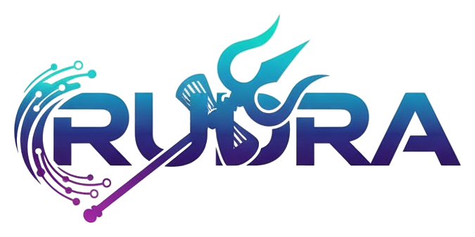

<div align="center">



# Rudra

**Open-source managed authentication platform powered by Keycloak**

[](LICENSE)
[](docker-compose.yml)
[](sdk/python/)
[](sdk/javascript/)

Clerk-level features — user management, SSO, organizations, webhooks, RBAC, analytics, and coupons — running on your own infrastructure.

[Quick Start](#quick-start) · [Documentation](https://rudra-auth.github.io/rudra/) · [SDK](#sdk) · [Contributing](CONTRIBUTING.md)

</div>

---

## Quick Start

```bash
docker compose up --build
```

| Service     | URL                       | Credentials       |
|-------------|---------------------------|--------------------|
| Dashboard   | http://localhost:3000      | Register new acct  |
| API Docs    | http://localhost:8000/docs | Bearer token       |
| Keycloak    | http://localhost:8080      | admin / admin      |

## Features

- **Email/Password, Social Login, Magic Links, MFA** — Full auth stack per project
- **Enterprise SSO** — OIDC + SAML identity providers
- **B2B Organizations** — Multi-tenant orgs with roles, invitations, domain auto-join
- **RBAC** — Custom roles assigned to users, reflected in JWT tokens
- **Webhooks** — Real-time events (user.created, org.created, etc.) with delivery logs
- **Coupons** — Discount codes with plan restrictions, usage limits, expiry tracking
- **Analytics** — User signup trends, login tracking, activity audit log
- **Session Management** — View, revoke sessions, user impersonation
- **Bot Protection, Breach Detection, Disposable Email Blocking** — Security features
- **Multi-tier Plans** — Free / Pro / Business / Enterprise with feature gating

## Architecture

```
React (3000) → FastAPI (8000) → Keycloak (8080)
                    ↓
          MongoDB (27017) + Postgres (5432) + Redis (6379)
```

## SDK

Rudra ships with official SDKs for Python and JavaScript.

### Python

```bash
cd sdk/python && pip install -e .
```

```python
from rudra_sdk import RudraClient

client = RudraClient("http://localhost:8000",
    email="admin@example.com", password="secret")

# Create project with coupon
client.projects.create("My App", "my-app", plan="pro", coupon_code="WELCOME50")

# Manage users
client.users.create("my-app", username="jane", email="jane@co.com", password="pass123")
users = client.users.list("my-app", search="jane")

# Organizations, roles, webhooks, SSO...
client.organizations.create("my-app", name="Acme", slug="acme")
client.roles.create("my-app", name="editor")
client.webhooks.create("my-app", url="https://app.com/hook", events=["user.created"])
client.sso.add_oidc("my-app", alias="google", client_id="...", client_secret="...")
```

### JavaScript

```bash
npm install @rudra/sdk  # or import from sdk/javascript/
```

```javascript
import { RudraClient } from '@rudra/sdk';

const client = new RudraClient('http://localhost:8000');
await client.login('admin@example.com', 'secret');

await client.projects.create('My App', 'my-app', 'pro');
await client.users.create('my-app', { username: 'jane', email: 'jane@co.com', password: 'pass123' });
await client.organizations.create('my-app', { name: 'Acme', slug: 'acme' });
```

See full SDK docs: [Python](sdk/python/README.md) | [JavaScript](sdk/javascript/README.md)

## Plans

| | Free | Pro $25 | Business $99 | Enterprise $499 |
|---|---|---|---|---|
| Users | 10K | 100K | 500K | Unlimited |
| Projects | 1 | 5 | Unlimited | Unlimited |
| Organizations | — | 50 | Unlimited | Unlimited |
| SAML SSO | — | — | 3 | Unlimited |
| Webhooks | — | 3 | 10 | Unlimited |
| Analytics | — | ✓ | ✓ | ✓ |
| Impersonation | — | ✓ | ✓ | ✓ |
| Bot Protection | — | ✓ | ✓ | ✓ |
| Coupons | ✓ | ✓ | ✓ | ✓ |

## Project Structure

```
rudra/
├── backend/              # FastAPI (50+ endpoints)
├── frontend/             # React + Vite dashboard
├── sdk/
│   ├── python/           # rudra Python package
│   └── javascript/       # @rudra/sdk npm package
├── docker-compose.yml    # 6-service stack
├── docs.html             # Full documentation (open in browser)
├── LICENSE               # MIT
├── CONTRIBUTING.md       # Contribution guide
└── README.md
```

## Contributing

We welcome contributions! See [CONTRIBUTING.md](CONTRIBUTING.md) for guidelines.

## License

[MIT](LICENSE) — free for personal and commercial use.
